# ApexTracker

A single Android app that does the job I was spreading across a pile of post-its, three
reminder apps, a calendar, and a couple of spreadsheets. Budget, study time, screen time,
reminders, notes, a reading log for papers — and a home screen that scores each day by how
many of my own goals I actually hit.

It is not trying to be new or clever. It is trying to be *mine* — the one app I open every
day because every screen in it is something I genuinely use.

<p align="center">
  
  
  
  
</p>

---

## Why this exists

I started this to build a habit — the habit of building. That is honestly why the idea is so
generic: "a tracker app" is the kind of project you can pick up on any given day and make a
little progress on, and the point at the start was the *consistency*, not the concept.

Somewhere along the way it stopped being an exercise. I realised I was reaching for it instead
of the scattered mess I used to juggle — the sticky notes, the half-abandoned reminder apps,
the calendar I never checked, the budget spreadsheet I opened once a month. One place, offline,
that just held all of it.

And then it grew a point of view. I don't want an app that wants more of my attention. I want
the opposite: something that **minimises how much I *need* my phone, and maximises the value of
the time I do spend on it.** So the rule for every feature became simple — would I, personally,
open this every single day? If not, it doesn't ship. Screen-time tracking sits in the same app
as everything else precisely because the goal is to look at the phone *less*.

None of this is revolutionary. It's a one-stop shop for organising my own life, fit to exactly
one person. That was always the point.

## How it looks — and how it changed

The app just went through a full visual redesign. It used to wear a warm identity — near-black
with a terracotta accent and a serif display face. It was nice, but honestly it read like a lot
of other things I'd seen, so I pulled it in a direction that feels like an *instrument*: cold
graphite, no accent colour at all, a monospaced display voice, and the consistency heatmap
redrawn as fill-height bars instead of coloured squares. Colour now only ever means something —
green for a goal met, red for a limit blown — and nothing else.

Here is the same app, before (Ember) and after (Graphite):

<table>
<tr><th>Before — Ember</th><th>After — Graphite</th></tr>
<tr>
<td>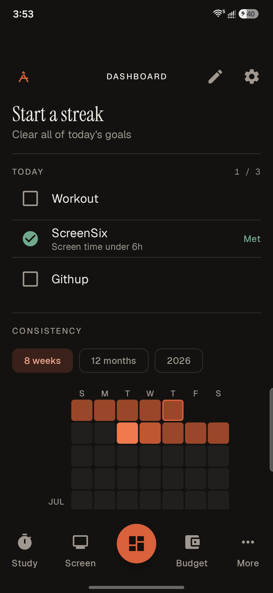</td>
<td>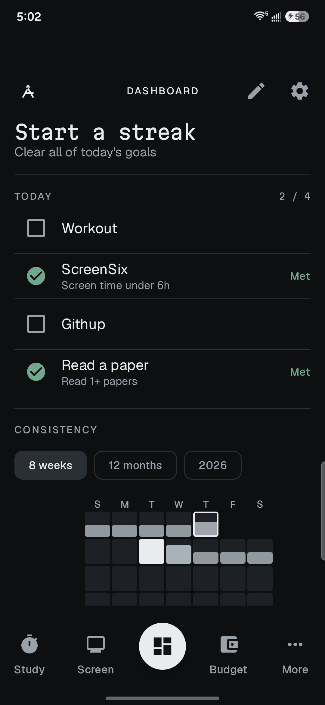</td>
</tr>
<tr><td colspan="2"><sub><b>Dashboard</b> — the home. The consistency graph went from coloured squares to bars whose height is the share of that day's goals I met; the accent gave way to plain ink, and the display type is now a monospace.</sub></td></tr>
<tr>
<td>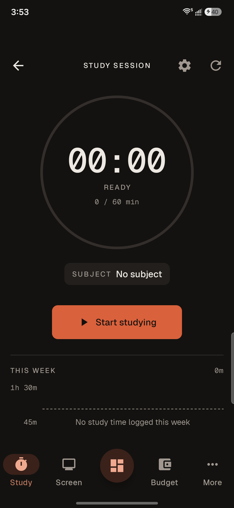</td>
<td>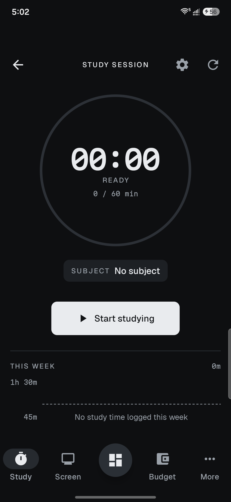</td>
</tr>
<tr><td colspan="2"><sub><b>Study timer</b> — the stopwatch in monospaced numerals reads like a real instrument panel now. The start button is ink, not an accent.</sub></td></tr>
<tr>
<td>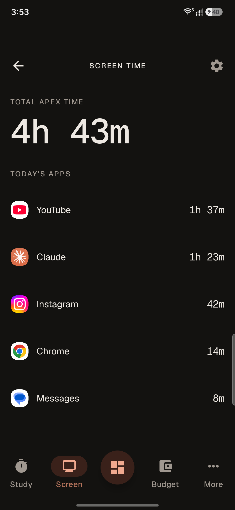</td>
<td>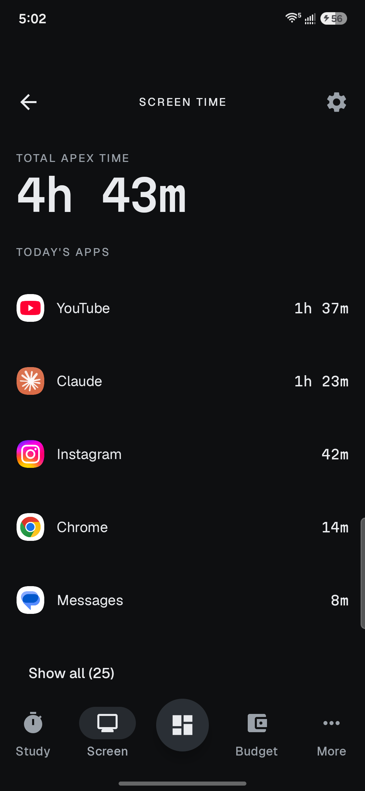</td>
</tr>
<tr><td colspan="2"><sub><b>Screen time</b> — per-app usage for the day. The app icons keep their own colours because they're content; everything that's <i>my</i> app stays monochrome.</sub></td></tr>
<tr>
<td>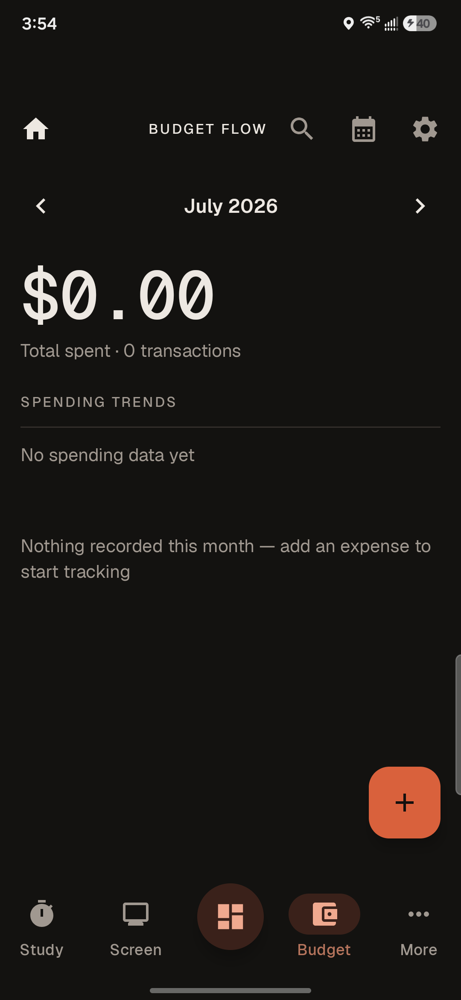</td>
<td>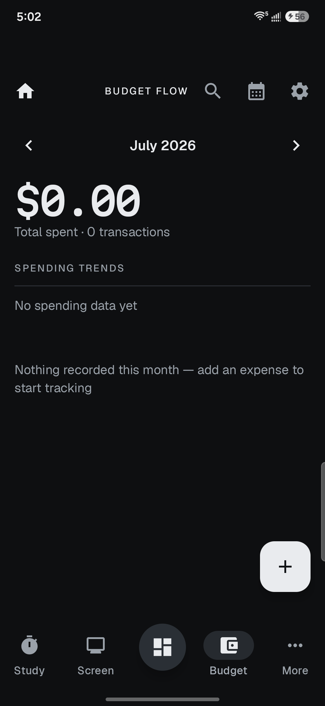</td>
</tr>
<tr><td colspan="2"><sub><b>Budget</b> — the month's spend as a headline figure, with category limits and a spending trend below.</sub></td></tr>
</table>

## What's inside

Everything is offline-first — the local database is always the source of truth, and signing in
with Google only adds optional sync so the data can follow me to another device.

- **Dashboard** — the home. A consistency heatmap where each day is scored by the fraction of my
  active goals met. Goals can be manual check-offs or automatic ones evaluated from the other
  trackers ("screen time under 6h", "study 2h", "read a paper today").
- **Budget** — expenses by category, per-category and overall monthly limits, a spending-trend
  chart, subscriptions, a calendar view, CSV export, and a camera button that reads a receipt
  photo and fills the form in for me.
- **Study timer** — a split-flap digit display with per-subject tracking, daily history, and
  manual back-fill for sessions I forgot to time. Starting it drops into a full-screen focus mode
  that hides the app chrome and keeps the screen awake.
- **Screen time** — per-app usage from Android's usage stats, with per-app daily limits.
- **Reminders** — one-off and recurring, with real notifications: exact alarms, reboot-safe,
  and Done / Snooze actions right on the notification.
- **Notes** — quick notes with pinning, search, and image attachments.
- **Papers** — a reading log for academic papers: a queue, one rotating pick a day, and a short
  memo of what I learned once I've read one. It pulls metadata from Semantic Scholar and opens
  the PDF externally — the app owns the knowledge, not the reading. Rating what I finish feeds a
  "Because you read …" shelf of similar papers.
- **Home-screen widgets** — five of them: today at a glance, a study timer I can start and stop
  without opening the app, this month's budget, the goal streak, and today's goals.
- **Security** — the database file is encrypted at rest, and an optional biometric lock gates
  Budget and Notes behind a device unlock.

## The three most recent additions

<table>
<tr>
<td width="33%" valign="top">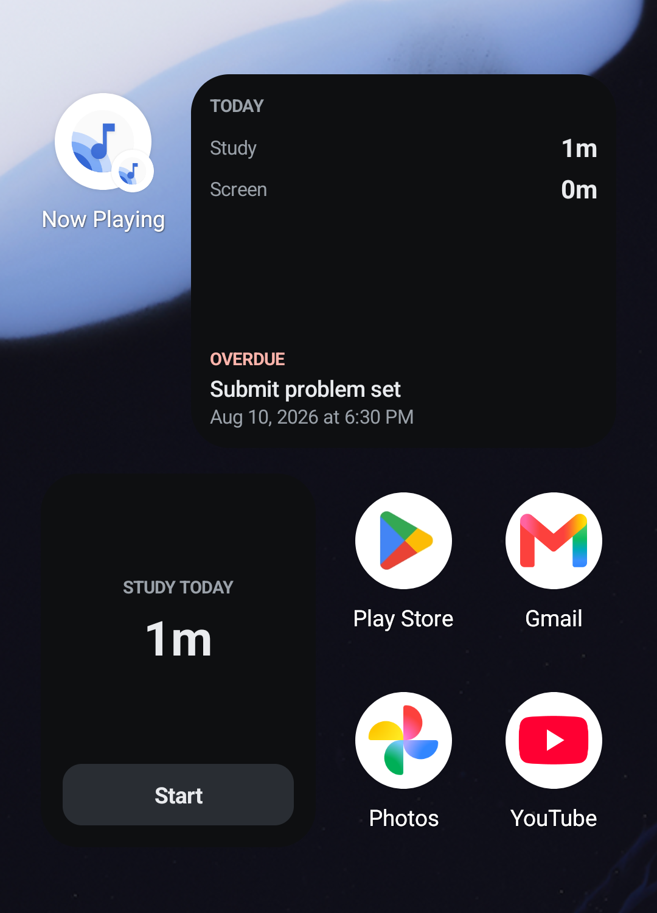</td>
<td width="33%" valign="top">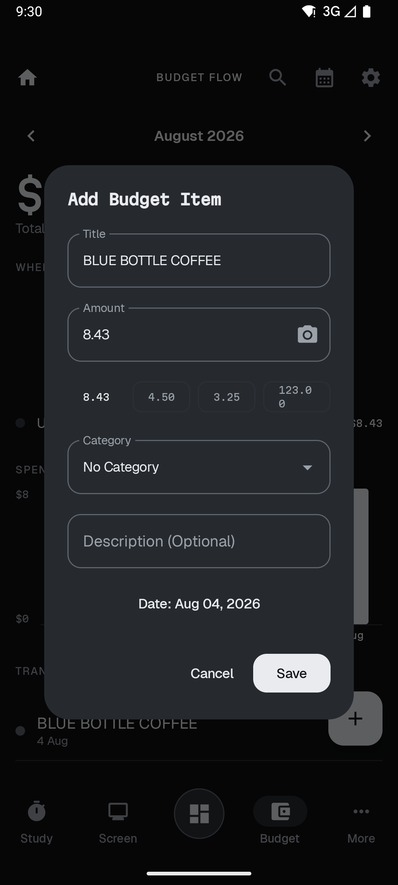</td>
<td width="33%" valign="top">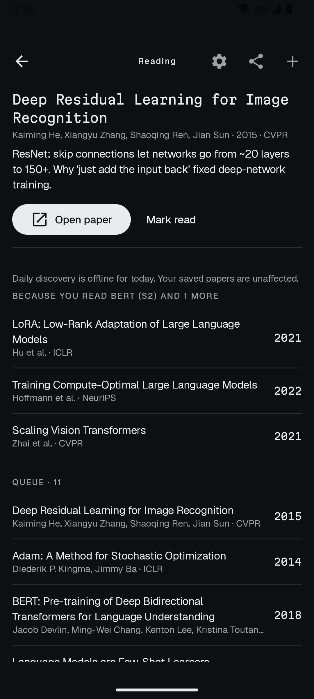</td>
</tr>
<tr valign="top">
<td><sub><b>Widgets I don't have to open the app for.</b> Today's study and screen time with whatever's next on the list — and a study timer I can start from the launcher. That last one is why the timer's start/stop logic now lives in one shared file instead of inside the ViewModel: the widget and the in-app button have to bank time to exactly the same place, or a session that runs past midnight lands on the wrong day.</sub></td>
<td><sub><b>Photograph a receipt, get an expense.</b> On-device text recognition, nothing uploaded, no camera permission (it uses the photo picker). The chips are the other amounts it found, in case it picked wrong — and it drops the subtotal and the tax rather than offering them, because a wrong candidate is worse than one fewer.</sub></td>
<td><sub><b>Papers like the ones I actually finished.</b> Rating a paper 4–5 makes it a positive example, 1–2 or abandoning it a negative one, and Semantic Scholar returns neighbours. The heading names what it reasoned from, so a bad recommendation is traceable rather than mysterious.</sub></td>
</tr>
</table>

## What I learned

This is the part that was the actual goal. Building it taught me a real slice of Android:
Jetpack Compose and an MVVM structure; Room, and the discipline of hand-writing database
**migrations** so I never lose data across a schema change; requesting and handling **device
permissions** (usage stats, exact alarms, notifications); wiring up **Firebase Auth and
Firestore** for cross-device sync, and learning where client-side trust ends and security rules
begin; background work with WorkManager and AlarmManager; **home-screen widgets** with Glance,
which run in the launcher's process and can't see any of the app's theming or state; **on-device
ML** for reading receipts; **encrypting the database at rest** with a key the Android Keystore
holds; and building and enforcing a real **design system**, so the whole app can change its
identity from one place.

The lesson that keeps repeating is that **it isn't done until it's run on a device**. The receipt
parser passed every test I wrote and then filled in the street number from the shop's address,
because text recognition returns a receipt's labels and its amounts as two separate blocks — so
"TOTAL" never shares a line with its figure. The encryption work took four rounds of the same
thing: a native library that doesn't load itself, open flags that quietly propagate into `ATTACH`,
two key formats that look identical and aren't, and a memory-locking default that stalled the app
outright. None of that is in the documentation. All of it is now in mine.

## Tech stack

Kotlin · Jetpack Compose · Material 3 · MVVM · Room + SQLCipher · Firebase (Auth + Firestore) ·
WorkManager · ML Kit text recognition · Coil · Glance widgets ·
minSdk 26 / targetSdk 35 / compileSdk 37.

The visual identity — type, colour, spacing, motion, the chart spec — lives in `ui/design/` and
is documented in [`Design.md`](Design.md); the rules applied while building UI are in
[`.claude/skills/android-product-design`](.claude/skills/android-product-design/SKILL.md).

## Getting started

Requires **JDK 17+**. On my machine the system default is JDK 11, so I point Gradle at Android
Studio's bundled JBR:

```bash
JAVA_HOME="/Applications/Android Studio.app/Contents/jbr/Contents/Home" ./gradlew assembleDebug
JAVA_HOME="/Applications/Android Studio.app/Contents/jbr/Contents/Home" ./gradlew installDebug
```

The app builds and runs **fully offline** with no Firebase config — sign-in and cloud sync just
stay disabled until you add a `google-services.json`.

To enable sync: create a Firebase project, register an Android app with your debug SHA-1
(`keytool -list -v -keystore ~/.android/debug.keystore -alias androiddebugkey -storepass android`),
download the generated `google-services.json`, and drop it at `app/google-services.json`. That
file is gitignored and must never be committed.

## Building & testing

```bash
JAVA_HOME="<jdk17>" ./gradlew assembleDebug                 # build
JAVA_HOME="<jdk17>" ./gradlew testDebugUnitTest             # unit tests (pure logic)
JAVA_HOME="<jdk17>" ./gradlew lintDebug                     # lint (0 errors expected)
JAVA_HOME="<jdk17>" ./gradlew validateDebugScreenshotTest   # Compose screenshot tests
```

Unit tests cover the pure logic pulled out of the ViewModels — scoring, formatting, recurrence,
queue/pick logic, API parsing — so it can be tested without the Android framework.
[`CLAUDE.md`](CLAUDE.md) has the full architecture notes and history.

## License

No license has been chosen yet. All rights reserved by the author until one is added.
